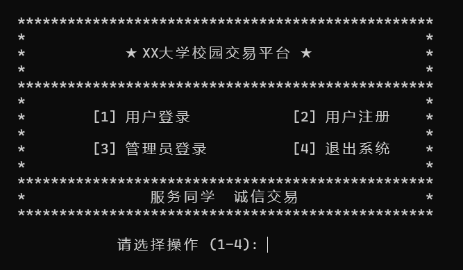
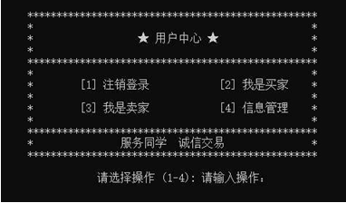
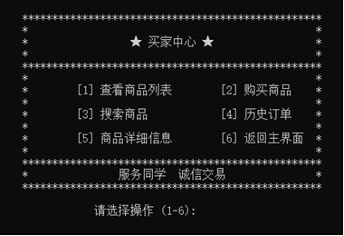
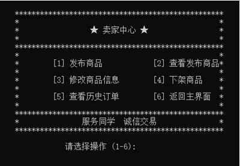
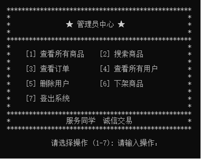

# 一 需求分析
## 1.1 问题描述
开发一个面向校园的二手交易平台，管理用户、商品与订单信息，支持买卖双方和管理员的基本操作。核心数据包括：用户（ID、用户名、密码、联系方式、地址、钱包余额）、商品（ID、名称、价格、卖家ID、上架时间、状态、描述）、订单（ID、商品ID、金额、卖家ID、买家ID、时间）。

## 1.2 目标用户与主要功能
- 普通用户：注册、登录、查看和修改个人信息、充值。
- 买家：浏览/搜索商品、查看商品详情、下单购买、查看订单历史。
- 卖家：发布/编辑/下架商品、查看自己发布的商品与订单。
- 管理员：查看/搜索所有用户、商品与订单，处理违规（删除用户、下架商品）。

## 1.3 系统概览
系统由用户管理、商品管理、订单管理和搜索/查询四个模块组成，数据以文件存储为主。系统目标是功能清晰、交互简明，并保证基本的数据校验（如用户名唯一、余额校验、必填字段校验等）。
# 二 系统设计  
## 2.1 数据设计  
### 2.1.1 用户类的设计  
该类定义了获取与修改ID、用户名、电话号码、地址、钱包余额等功能。  

             Users
- id: string  
- username: string
- password: string 
- phone: string
- address: string
- balance: string 
+ Users()   
+ Users(id: string, username: string, password: string, phone: string, address: string, balance: string)
+ setId(id: string): void  
+ setUsername(username: string): void 
+ setPassword(password: string): void
+ setPhone(phone: string): void  
+ setAddress(address: string): void 
+ setBalance(balance: string): void
+ getId(): string 
+ getUsername(): string 
+ getPassword(): string   
+ getPhone(): string  
+ getAddress(): string  
+ getBalance(): string 
### 2.1.2 商品类的设计
该类实现了获取和修改商品ID、名称、价格、描述、售卖人ID、上架时间、商品状态等功能。  

            Product
- ID: string
- name: string
- price: string  
- description: string
- sellerID: string  
- putOnTime: string   
- status: string        
  
+ Product()  
+ Product(ID: string, name: string, price: string, description: string, sellerID: string, putOnTime: string, status: string)
+ getID(): string  
+ getName(): string  
+ getPrice(): string 
+ getDescription(): string
+ getSellerID(): string  
+ getPutOnTime(): string
+ getStatus(): string
+ setID(id: string): void 
+ setName(newName: string): void
+ setPrice(newPrice: string): void
+ setDescription(desc: string): void
+ setSellerID(seller: string): void
+ setPutOnTime(time: string): void
+ setStatus(newStatus: string): void 

# 三 功能展示
主界面：

用户界面：

买家界面：

卖家界面：

管理员界面：

